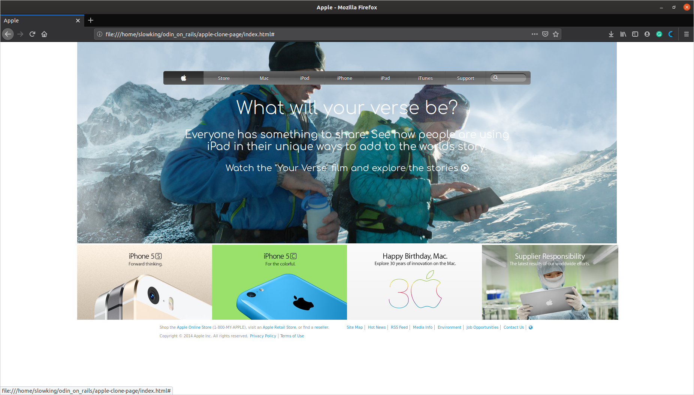

# Building with Backgrounds and Gradients
> This project consists of building a webpage using images as a background and adding gradients to elements.

## Details
### HTML Structure
#### Header
For the `<header>` I choose to use an `<a>` tag which would be the background image, the reason for this is that the image should be a clickable link and redirect to that article even if its on background. On top of this would be the `<navbar>` which buttons were made with `<li>` inside an `<ul>` and each of those has its own `<a>` element to make them clickable as well. There is also a `
` element inside of each to make the *shadow* effect on the bar. For the *search bar*, I used an `<input>` inside its own `<label>` and all of these elements resize and align themselves with a *flexbox*.

Below the `<navbar>` there is a title and some paragraphs and one of them redirects to a video. For all of these, I used `<a>` tags since they redirect to another page.

#### Showcase
This was the easier part since they only where four `
` each with their own `` element to put the images inside. 

#### Footer
This one was made by floating elements to both sides of the screen. Two of the strings are `
` tags and one is `<ul> & <li>` since these are a bunch of links to different parts of the website.

### CSS Styling
#### Header
The styling of the header was the most complicated part, specifically the navbar. All the buttons should be aligned using `display: flex` property because, once the search bar gets larger, all the buttons should reduce their size, however, the actual search bar should maintain its absolute size. To acquire the metal effect of apple I used `radial-gradient` backgrounds and `box-shadow` to emulate the effect of a pressed button.

The styles of the rest of the elements on the **header** were really simple, most of them maintained as `inline-block` elements while the `text-align: center` property took care of the horizontal spacing.

#### Showcase
The positioning here was just stablish every `
` element as `display: inline-block` and the `text-align: center` property would take care of the rest. Since all of their dimensions were absolute values there wasn't trouble with responsiveness.

#### Footer
For the footer, I used the `float` property to align everything on two columns.
The links on the footer were aligned using the `display: inline-block` property on each one of the `<li>` items.
I removed the list styling and links underline of the elements with the properties `list-style: none` & `text-decoration: none` respectively.

## Built With
- HTML5, CSS
- VSCode

## Live Demo

## Author
- Github: [@SlowKingV](https://github.com/SlowKingV)
- Twitter: [@SlowKingVI](https://twitter.com/SlowKingVI)
- Linkedin: [Diego Luna Granados](https://www.linkedin.com/in/diego-luna-granados-64007b197/)
